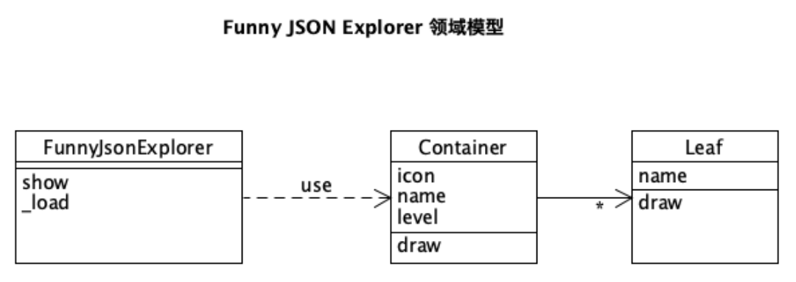
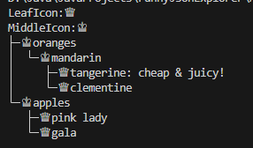
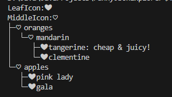
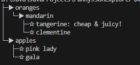
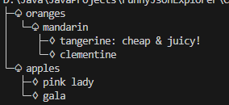
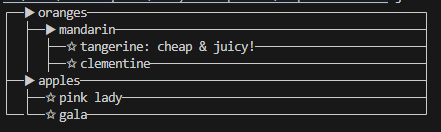
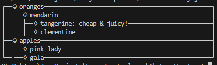

# Funny JSON Explorer 软件工作作业

## 实验要求

1. **开发一个名为Funny JSON Explorer（FJE）的命令行界面小工具**，该工具用于可视化JSON文件。

2. **需求分析**：
   
   - 能够快速切换不同的可视化风格，包括树形（tree）和矩形（rectangle）。

     ```bash
     ├─♢oranges
     │ └─♢mandarin
     │ ├─♤clementine
     │ └─♤tangerine: cheap & juicy!
     └─♢apples
     └─♤gala
     poker-face-icon-family: 中间节点icon：♢ 叶节点icon：♤
     
     ┌─ oranges ───────────────────────────────┐
     │ ├─ mandarin  ───────────────────────────┤
     │ │ ├─ clementine   ──────────────────────┤
     │ │ ├─ tangerine:   cheap & juicy! ───────┤
     ├─ apples ────────────────────────────────┤
     └──┴─✩gala ───────────────────────────────┘
     矩形（rectangle）
     ```
   
   - 允许用户通过命令行参数指定JSON文件、风格和图标族。
   
3. **命令行使用示例**：
   
- `fje -f <json file> -s <style> -i <icon family>`
  
4. **领域模型**

   

5. **设计模式要求**：
   - 使用工厂方法（Factory）、抽象工厂（Abstract Factory）、建造者（Builder）模式、组合模式（Composition）来设计和实现软件。
   - 确保程序易于扩展和维护。

6. **具体任务**：

   - （必做）在不改变现有代码的情况下添加新的抽象工厂添加新的风格。
   - （选做）通过配置文件添加新的图标族。

## 实验流程

### 使用四种设计模式实现任务要求

在本次作业中，我们需要使用工厂方法（Factory）、抽象工厂（Abstract Factory）、建造者（Builder）模式、组合模式（Composition）来设计和实现软件，在这里我展示设计得到的类图，具体的代码请参考github上的代码

#### 类图


#### 抽象工厂

`ContainerFactory `是抽象工厂的接口，而`TreeDefaultFactory` 是具体的抽象工厂，`ContainerFactory `提供一个接口来创建产品族，产品的具体生产由具体抽象工厂类决定。

#### 工厂方法

在每一个抽象工厂中，createContainer是工厂方法模式的方法

#### 建造者模式

ContainerFactory是Builder，而Director指挥Builder进行生产，ContainerFactory类的createContainer方法是Builder模式中的结果方法（getResult），add是Builder的部分方法（buildPartX）

#### 组合模式

组合模式（Composite Pattern）是一种结构型设计模式，它将对象组织成树形结构，以表示“部分-整体”的层次结构。组合模式使得客户端对单个对象和组合对象的使用具有一致性。在我的实现中，Component既是Style也是IconFamily，这种模式使得客户端可以一致地处理单个对象和组合对象，简化了客户端的操作。`Container`作为组合节点，通过组合和调用子组件，实现了Composite模式。

### 在不改变现有代码的情况下添加新的抽象工厂添加新的风格

由于设计时确保了程序的可扩展性，下面我举一个简单的例子，展示怎么在不改变现有代码的情况下添加新的抽象工厂以添加新的风格

假设现在我们有一个新的风格`newStyle`类

```Java
public class newStyle extends Style {
    public void draw(Map<String, Object> json, IconFamily iconFamily) {
        // 新风格的draw逻辑实现
    }          
}
```

添加新的抽象工厂来添加新的风格(以Default图标类为例)

```java
public class newDefaultContainerFactory implements ContainerFactory{
    public Container createContainer(){
        Style style = new newStyle();
        IconFamily icon = new DefaultIconFamily();
        return new Container(style, icon);
    }
}
```

然后只要在核心类`JsonExplorer`中创建这种新的抽象工厂就可以直接添加新的风格了

```java
public JsonExplorer(ContainerFactory containerFactory) {
    ContainerFactory containerFactory = new newDefaultContainerFactory();
	this.container = containerFactory.createContainer();
}
```

### 通过配置文件添加新的图标族

要实现通过修改配置文件生成新的图标族，一种简单的解决方法是：创建一个配置图标类：这个类通过读取配置文件中的图标，将图标应用到使用的风格中

```java
package FunnyJsonExplorer.src;

import java.io.IOException;
import java.nio.charset.StandardCharsets;
import java.nio.file.Files;
import java.nio.file.Paths;
import java.util.HashMap;
import java.util.Map;

public class ConfigIconFamily extends IconFamily {
    private static String leafIcon;
    private static String middleIcon;

    // Static block to read from YAML file once when the class is loaded
    static {
        Map<String, String> config = new HashMap<>();
        try {
            // Read file content as a string
            String content = new String(Files.readAllBytes(Paths.get("config.yaml")), StandardCharsets.UTF_8);
            String[] lines = content.split("\\n");

            leafIcon = lines[3].replaceAll("\\s", "")+" ";
            middleIcon = lines[1].replaceAll("\\s", "")+" ";
            System.out.println("LeafIcon:"+leafIcon);
            System.out.println("MiddleIcon:"+middleIcon);

        } catch (IOException e) {
            e.printStackTrace();
            throw new RuntimeException("Failed to load icons from config.yaml", e);
        }
    }

    @Override
    public String getLeafIcon() {
        return leafIcon;
    }

    @Override
    public String getMiddleIcon() {
        return middleIcon;
    }
}
```

以下面`config.yaml`文件为例：

```yaml
MiddleIcon:
  ♔ 
LeafIcon:
  ♕ 
```

运行程序结果如下：



如果我们想添加新的图标族，我们只需要修改`config.yaml`文件，如下所示：

```yaml
MiddleIcon:
  ♡ 
LeafIcon:
  ❤ 
```

再次运行程序，我们可以看到新的图标族已经被应用了：



## 运行截图

### Default图标族+树形风格



### Poker图标族+树形风格



### Default图标族+矩阵风格



### Poker图标族+矩阵风格

